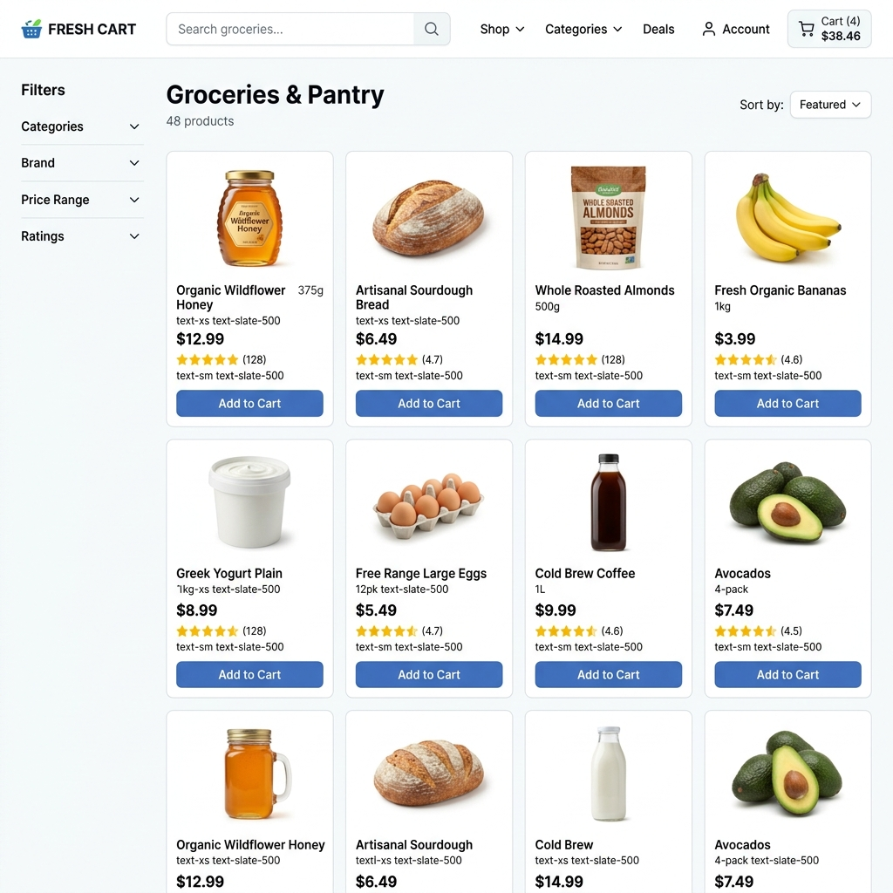
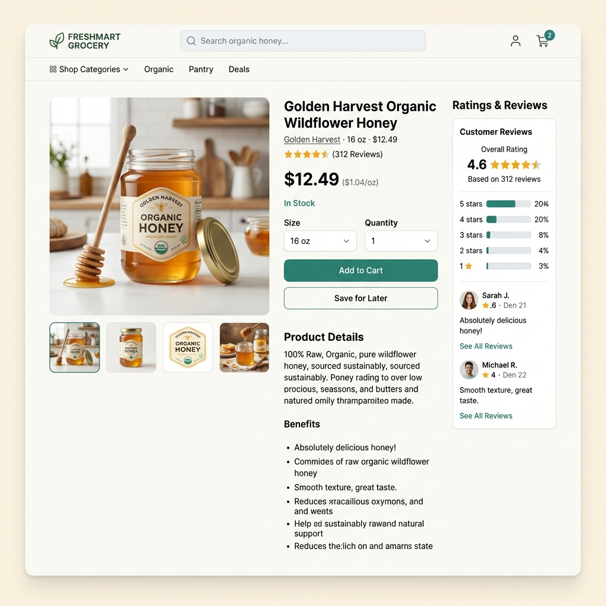
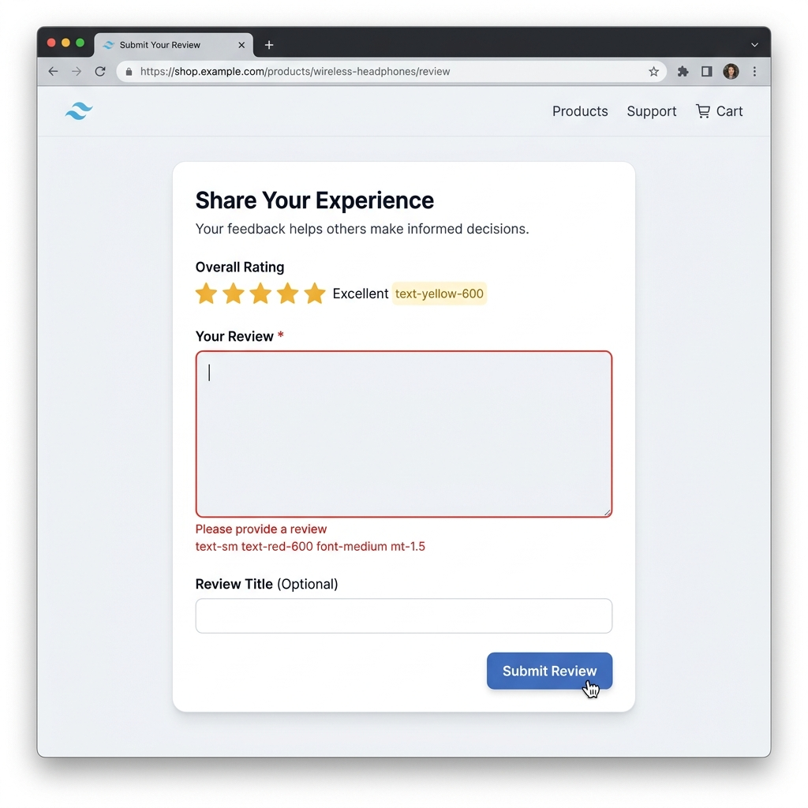

# Product Ratings & Reviews Module

## Project Description
A full-stack MERN application that serves as a standalone, portfolio-quality demo of a complete product catalog and ratings/reviews system. This project implements a fully functioning review system with client-side and server-side validation, pagination, sorting, and dynamic product rating recalculations.

## Problem It Solves
The live site `naikfoods.co.in` displays a review count on product pages (e.g. "(56 Reviews)") but renders no actual reviews, no rating breakdown, and offers no way for customers to submit one. This project builds the missing Ratings & Reviews feature properly, demonstrating how a real-world e-commerce review module should be architected and integrated.

## Tech Stack
*   **Database:** MongoDB Atlas via Mongoose
*   **Backend:** Express.js + Node.js
*   **Frontend:** React (via Vite)
*   **Styling:** Tailwind CSS
*   **Validation:** Express-validator (server-side)

## Folder Structure
```
Bnv/
├── backend/                  # Express server & APIs
│   ├── models/               # Mongoose schemas (Product, Review)
│   ├── routes/               # API endpoints
│   ├── db.js                 # MongoDB connection logic
│   ├── index.js              # Server entrypoint
│   └── seed.js               # Mock data seeding script
├── frontend/                 # React frontend (Vite)
│   ├── public/               # Static assets
│   ├── src/                  # React components, styles, and assets
│   ├── index.html            # Vite entry HTML
│   ├── tailwind.config.js    # Tailwind configuration
│   └── vite.config.js        # Vite configuration
├── .gitignore                # Root git ignores
├── package.json              # Root concurrently scripts
└── README.md                 # Project documentation
```

## Setup & Installation
1.  **Clone the repository:**
    ```bash
    git clone https://github.com/shivam-vishwakarmaa/Bnv.git
    cd Bnv
    ```
2.  **Install dependencies (Root, Backend, and Frontend):**
    ```bash
    npm run install-all
    ```

## Environment Variables
Create `.env` files in both the `backend` and `frontend` directories based on the provided `.env.example` files.

**`backend/.env`**
```
MONGO_URI=mongodb://127.0.0.1:27017/bnv-reviews
PORT=5000
```

**`frontend/.env`**
```
VITE_API_URL=http://localhost:5000/api
```

## How to Run (dev)
From the project root, start both the backend server and frontend client concurrently:
```bash
npm run dev
```
*   Backend runs on `http://localhost:5000`
*   Frontend runs on `http://localhost:5173`

## How to Run (seed data)
To populate the database with mock products and a realistic distribution of reviews:
```bash
cd backend
npm run seed
```

## API Endpoints

| Method | Endpoint | Description | Payload / Query |
| :--- | :--- | :--- | :--- |
| **GET** | `/api/products` | Get paginated products | `?page=1&limit=10&category=...&search=...` |
| **GET** | `/api/products/:slug` | Get single product & rating breakdown | - |
| **GET** | `/api/products/:slug/reviews` | Get product reviews | `?page=1&sort=newest\|highest\|helpful` |
| **POST** | `/api/products/:slug/reviews` | Submit a new review | `{ reviewerName, reviewerEmail, rating, title, body }` |
| **POST** | `/api/reviews/:id/helpful` | Upvote a review | - |

## Screenshots
*Paste your image links below:*

- **Product Catalog / Grid:** 

- **Product Details & Rating Breakdown:** 

- **Review Submission Modal / Form:** 

- **Mobile Viewport (375px):** 


## Deployed URL
**Live Demo (Frontend):** https://frontend-lovat-iota-46.vercel.app
**Backend API:** https://backend-beige-eight-24.vercel.app

## Known Limitations
*   **Authentication:** There is no full user authentication system implemented; reviews are tracked and rate-limited strictly by email address in the schema.
*   **Image Uploads:** Product and review images rely on external URLs (Unsplash) rather than a dedicated cloud storage solution (like AWS S3 or Cloudinary).
*   **Transactions:** The product rating recalculation uses a Mongoose post-save hook instead of full MongoDB replica-set transactions. While sufficient for a demo and most standard traffic, high-concurrency environments might prefer full ACID transactions.
*   **E-commerce Functionality:** There is no working "Add to Cart" or checkout logic; this demo strictly focuses on the Product Catalog and the Ratings & Reviews module.
*   **Production Deployment:** Currently setup for local development. A production deployment would require compiling the React frontend and securely exposing the backend API (e.g. configuring CORS origins, reverse proxy, PM2).

## Possible Future Improvements
*   Implement JWT-based user authentication and user profiles.
*   Add image uploads for reviews using Multer and a cloud provider.
*   Implement a caching layer (like Redis) for the `GET /api/products` routes.
*   Add an admin dashboard to moderate/delete reviews.
